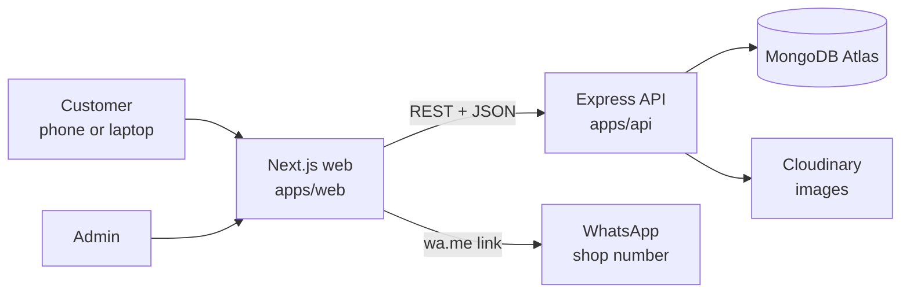
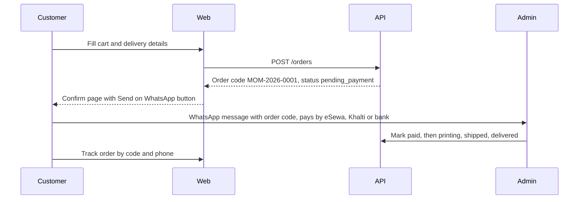
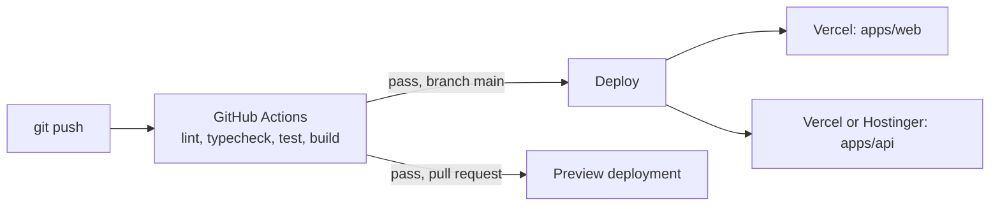

# Momento: Build Plan and Claude Code Prompts

2026-09-19 · @Someone

## Overview and decisions

Momento is a Nepal-made photo book, frame and print store with a Popsa-grade experience: fast, animated, mobile-first, and paid through WhatsApp. This doc gives you the analysis, brand system, architecture, and nine copy-paste prompts (Phase 0 to 8) to build it with Claude Code, plus a skill file so every session follows the same rules.

I made these calls so you can start without waiting. Change any of them in a comment and I will revise the prompts.

| Decision            | Choice                                                                                                | Why                                                                                           |
| ------------------- | ----------------------------------------------------------------------------------------------------- | --------------------------------------------------------------------------------------------- |
| Frontend            | Next.js 15 (App Router), TypeScript, Tailwind v4, shadcn/ui, Motion (motion/react)                    | Server rendering gives the SEO, GEO and AEO you asked for; Motion gives Popsa-style animation |
| Backend             | Separate Node.js + Express + Mongoose API in its own folder                                           | Clean frontend/backend split, deployable to Vercel or a Hostinger VPS                         |
| Database            | MongoDB Atlas (free tier) via Mongoose                                                                | Stores users, products, orders, reviews                                                       |
| Images              | Cloudinary                                                                                            | Admin uploads, automatic resizing, fast CDN                                                   |
| Payment             | Manual: order is saved, customer taps a WhatsApp button with a prefilled message, admin marks it paid | Matches how Nepali small shops sell today; no gateway needed                                  |
| Repo                | pnpm monorepo: apps/web, apps/api, packages/shared                                                    | One GitHub repo, one CI pipeline, shared validation schemas                                   |
| CI/CD               | GitHub Actions on every push; Vercel deploys web, API deploys to Vercel or Hostinger                  | Matches your requirement                                                                      |
| Currency and locale | NPR, English first, Nepali (ne) added in Phase 8                                                      | Local buyers first                                                                            |

Two assumptions to note. First, "react motion" is taken to mean the Motion library (the successor to Framer Motion, imported from `motion/react`), with Lenis for smooth scrolling. Second, Momento sells physical products (photo books, framed prints, magnets, canvases), so the site is a catalogue plus an order-request flow, not a photo-editor app in version 1. A browser photo-layout editor is listed as a later feature in the analysis section.

## Site analysis and features to add

Popsa wins on trust and simplicity: it puts reviews, guarantees and a three-step "how it works" ahead of any price. Momento should copy the structure of that persuasion, not the visuals. I opened [popsa.com/en-us](https://popsa.com/en-us/) for the Popsa row; the other rows are from my general knowledge of those sites and were not fetched this session, so treat them as approximate.

| Site                                                                         | What it does best                                                                                                                                             | Take for Momento                                                                    |
| ---------------------------------------------------------------------------- | ------------------------------------------------------------------------------------------------------------------------------------------------------------- | ----------------------------------------------------------------------------------- |
| [Popsa](https://popsa.com/en-us/)                                            | Hero with review count badge, problem stat, feature grid, review carousels, premium finishes, 3-step guide, six guarantees, inspiration gallery, repeated CTA | Same section order, own copy and visuals; add WhatsApp CTA in place of app download |
| [Mixbook](https://www.mixbook.com/photo-books)                               | Template browsing by occasion, strong editor                                                                                                                  | Occasion pages (wedding, Dashain, Tihar, baby, travel)                              |
| [Artifact Uprising](https://www.artifactuprising.com)                        | Editorial photography, generous whitespace, material close-ups                                                                                                | Product pages with paper, cover and binding detail shots                            |
| [Mixtiles](https://www.mixtiles.com)                                         | Photo-on-wall preview, very short funnel                                                                                                                      | "See it on your wall" room mockups on product pages                                 |
| [Framebridge](https://www.framebridge.com)                                   | Choose size, then frame, then mat with live price                                                                                                             | Frame configurator: size, frame colour, mat, live NPR price                         |
| [Saal Digital](https://www.saal-digital.com/photo-book/design-a-photo-book/) | Pro-quality specs and paper comparisons                                                                                                                       | Comparison table of paper and cover options                                         |
| [Chatbooks](https://www.chatbooks.com)                                       | Subscription albums                                                                                                                                           | Later: monthly photo book plan                                                      |

UX patterns from Popsa to reproduce in your own style:

1. A hero that names the outcome, shows a real product image, and carries one review-count badge.
2. Scroll-triggered reveals: cards rise and fade in, product images tilt slightly on hover, numbers count up.
3. Review carousels (text plus photo) placed right after the features, not at the bottom.
4. A short guarantee strip: delivery time, quality promise, human support on WhatsApp, easy reprint.
5. Occasion-led inspiration gallery that links straight into the matching category.
6. A sticky mobile bar with a single WhatsApp order button, since most Nepali traffic is on phones.

Pages to include beyond Popsa's homepage:

- Home, Shop (with category filters), Product detail, Cart, Checkout (name, phone, address, delivery area, note)
- Order confirmation with the WhatsApp button and a unique order code, and an order-tracking page by code plus phone
- Occasions, Inspiration gallery, Reviews (all reviews with photos)
- How it works, Pricing and delivery (Kathmandu valley, outside valley), FAQ, About, Contact
- Blog for SEO: photo tips, gift ideas, Nepal festivals
- Legal: privacy, terms, returns
- Admin: login, dashboard, products, services, orders, reviews, customers, homepage sections, settings

Features worth adding later, ranked by value for Nepal: 1) coupon codes and festival offers, 2) order tracking, 3) eSewa, Khalti and bank QR shown as manual options, 4) photo upload at order time with drag and drop, 5) gift cards, 6) subscription photo book, 7) a browser layout editor, 8) Nepali language and Nepali date (BS) display, 9) referral codes.

## Brand and design system

Momento uses four brand colours drawn from Nepal (Gurans crimson, Himalayan indigo, marigold, warm paper) so the site feels local and stays clearly different from Popsa's pink. Claude Code must use only these tokens; no random colours. These are my proposed values, so swap them if you already have a logo.

| Token                     | Hex     | Use                                   |
| ------------------------- | ------- | ------------------------------------- |
| `--brand` (Gurans)        | #D7263D | Primary buttons, links, key accents   |
| `--ink` (Himalaya indigo) | #1B2A4E | Headings, dark sections, footer       |
| `--accent` (Marigold)     | #F4A300 | Badges, stars, highlights, hover glow |
| `--paper`                 | #FBF7F2 | Page background                       |
| `--surface`               | #FFFFFF | Cards                                 |
| `--muted`                 | #5B6478 | Body secondary text                   |
| `--success`               | #1F9D6B | Paid, delivered                       |

White text on `--brand` and `--ink` passes WCAG AA; do not place white text on `--accent`, use `--ink` instead.

Typography: a friendly display face for headings (Fraunces or Poppins) and Inter for body, both loaded with `next/font` so there is no layout shift. Nepali text uses Noto Sans Devanagari.

Motion rules (Popsa-like, but Momento's own):

- Use Motion (`motion/react`): fade-and-rise reveal on scroll (y 24 to 0, 0.5 s, ease-out), staggered card grids (0.06 s), hover lift with soft shadow on product cards, a floating photo-collage hero that drifts with scroll parallax, count-up statistics, animated review carousel, page transitions.
- Lenis for smooth scroll. Animate only `transform` and `opacity`.
- Respect `prefers-reduced-motion`: disable parallax and reveals, keep the layout intact.
- Target Lighthouse mobile performance 90+ and CLS under 0.1.

UI kit: shadcn/ui components (Button, Card, Dialog, Sheet, Tabs, Accordion, Form, Table, Badge, Toast/Sonner, Carousel) themed through the CSS variables above, plus lucide-react icons. The admin panel uses the same tokens with denser spacing.

## System design

The browser talks only to the Next.js app for pages and to the Express API for data; the API is the single gatekeeper to MongoDB and Cloudinary.



The web app renders public pages on the server (fast first paint, crawlable by Google and AI answer engines). The admin area is a client-side app under `/admin`, protected by the API.

### Manual WhatsApp payment flow



### Security: the CIA triad

| Goal            | Controls to build                                                                                                                                                                                                                                                                           |
| --------------- | ------------------------------------------------------------------------------------------------------------------------------------------------------------------------------------------------------------------------------------------------------------------------------------------- |
| Confidentiality | Admin login with hashed passwords (argon2), JWT in httpOnly, Secure, SameSite cookies; role-based access (admin, staff); secrets only in environment variables; customer phone and address returned only to admin; HTTPS only; never log personal data                                      |
| Integrity       | Zod validation on every request using schemas shared from `packages/shared`; NoSQL-injection sanitising; server-side price calculation (never trust the client's price); CSRF protection for cookie auth; audit log of admin actions; order status changes only through allowed transitions |
| Availability    | Rate limiting on login, orders and reviews; request size limits; MongoDB indexes; Cloudinary CDN for images; Next.js caching and ISR for public pages; health-check endpoint; Atlas backups; graceful error pages                                                                           |

### Data models (Mongoose)

| Model       | Key fields                                                                                                                                                                                                               |
| ----------- | ------------------------------------------------------------------------------------------------------------------------------------------------------------------------------------------------------------------------ |
| User        | name, phone, email, passwordHash (admin/staff only), role, createdAt                                                                                                                                                     |
| Category    | name, slug, image, order, isActive                                                                                                                                                                                       |
| Product     | title, slug, categoryId, shortDescription, description (rich text), images\[\], basePrice, variants\[\] (size, cover, pages, price), highlights\[\], specs\[\], faqs\[\], seoTitle, seoDescription, isFeatured, isActive |
| Service     | title, slug, description, icon, image, startingPrice, showOnHome, order                                                                                                                                                  |
| HomeSection | type (hero, services, featured, reviews, guarantees, gallery), title, subtitle, itemRefs\[\], order, isVisible                                                                                                           |
| Order       | code, customer (name, phone, address, area), items\[\] (product snapshot, variant, qty, price), subtotal, deliveryFee, discount, total, status, paymentMethod, adminNotes, timestamps                                    |
| Review      | productId or serviceId, name, rating (1 to 5), title, comment, photos\[\], status (pending, approved, rejected), verifiedOrderCode                                                                                       |
| Coupon      | code, type, value, expiresAt, usageLimit                                                                                                                                                                                 |
| Settings    | shop WhatsApp number, delivery fees, social links, bank and wallet details, SEO defaults                                                                                                                                 |

### Folder structure

```text
momento/
  apps/
    web/                    # Next.js frontend
      src/app/(public)/     # home, shop, product, cart, checkout, blog
      src/app/admin/        # dashboard, products, services, orders, reviews
      src/components/ui/    # shadcn components
      src/components/motion/# Reveal, Stagger, Parallax, CountUp
      src/lib/  src/styles/tokens.css
    api/                    # Express backend
      src/models/  src/routes/  src/controllers/
      src/middleware/       # auth, validate, rateLimit, error
      src/services/         # cloudinary, whatsapp link, orders
      src/config/  src/server.ts
  packages/shared/          # zod schemas and TypeScript types
  .github/workflows/        # ci.yml, deploy.yml
  .env.example  pnpm-workspace.yaml  README.md
```

## SEO, GEO and AEO

SEO gets Momento found on Google, AEO makes it the direct answer in featured snippets and voice search, and GEO (generative engine optimisation) makes AI assistants such as ChatGPT, Claude and Gemini able to quote it. All three rest on the same base: server-rendered pages, clear structure, and facts stated plainly.

| Area                      | What to implement                                                                                                                                                                                                                             |
| ------------------------- | --------------------------------------------------------------------------------------------------------------------------------------------------------------------------------------------------------------------------------------------- |
| Technical SEO             | Server-rendered pages, `generateMetadata` per page, canonical URLs, `sitemap.xml` and `robots.txt` generated from the database, clean slugs, `next/image` with alt text, Core Web Vitals in the green                                         |
| Structured data (JSON-LD) | Organization and LocalBusiness (Kathmandu address, phone, hours), Product with offers in NPR, AggregateRating and Review from approved reviews, BreadcrumbList, FAQPage, HowTo for the 3-step guide, Article for blog posts                   |
| AEO                       | Each product and service page opens with a 40 to 60 word direct answer, followed by a real FAQ ("How long does delivery take in Kathmandu?", "How do I pay?"); question-style H2s; short tables for specs and pricing                         |
| GEO                       | An `llms.txt` file summarising the shop, products and policies; allow reputable AI crawlers in `robots.txt`; consistent facts (prices, delivery times, contact) everywhere; original photos, reviews and local content that AI tools can cite |
| Local Nepal SEO           | Google Business Profile for the shop, NAP consistency (name, address, phone), pages per city or area served, Nepali keywords and `hreflang` (`en`, `ne`) in Phase 8, Nepali festival landing pages (Dashain, Tihar, wedding season)           |
| Social sharing            | Open Graph and Twitter cards with a generated product image                                                                                                                                                                                   |

Start with these target keywords and refine with Google Search Console after launch: photo book Nepal, photo frame Kathmandu, custom photo album Nepal, photo magnet Nepal, canvas print Nepal, wedding album printing Kathmandu.

## CI/CD and deployment

Every push to GitHub runs checks; merging to `main` deploys. Pull requests get a preview URL.



| Target                        | Setup                                                                                                                                                 |
| ----------------------------- | ----------------------------------------------------------------------------------------------------------------------------------------------------- |
| Vercel, web                   | Import the repo, set root directory to `apps/web`, add environment variables, connect the domain. Vercel deploys on every push by itself.             |
| Vercel, API                   | A second Vercel project with root `apps/api`, exposing Express through a serverless handler (`api/index.ts`). Good for a low-traffic start.           |
| Hostinger VPS or Node hosting | Run the API with PM2 behind Nginx and HTTPS (Let's Encrypt). GitHub Actions connects over SSH, pulls, builds and restarts. Better when traffic grows. |
| MongoDB Atlas                 | Allow-list the API host, use a least-privilege database user, enable backups.                                                                         |
| Secrets                       | Store in GitHub Actions secrets and hosting environment variables, never in the repo. Keep `.env.example` with names only.                            |

CI checks (in `ci.yml`): install with pnpm cache, ESLint, TypeScript typecheck, unit tests (Vitest), API tests (Supertest plus in-memory MongoDB), build both apps, `pnpm audit`. Add Dependabot for weekly dependency updates and CodeQL for security scanning.

## Phased Claude Code prompts

Run these in order, one per Claude Code session, and commit after each phase passes its checks. Paste the global rules once at the start of every session (or save them in `CLAUDE.md` in Phase 0). Each prompt ends with acceptance checks so you know when to move on.

### Global rules (paste first)

```text
You are building "Momento", a Nepal-based photo book, photo frame and photo print e-commerce website, with a Popsa-like feel (warm, fast, animated, trust-focused) but its own visual identity. Do not copy Popsa's images, text or exact layout.

Stack: pnpm monorepo. apps/web = Next.js 15 App Router + TypeScript + Tailwind v4 + shadcn/ui + Motion (import from "motion/react") + Lenis. apps/api = Node.js + Express + TypeScript + Mongoose (MongoDB Atlas). packages/shared = Zod schemas and types used by both.

Rules:
1. Colours: use ONLY the brand tokens in apps/web/src/styles/tokens.css: --brand #D7263D, --ink #1B2A4E, --accent #F4A300, --paper #FBF7F2, --surface #FFFFFF, --muted #5B6478, --success #1F9D6B. No random hex values anywhere else.
2. Security (CIA): validate every input with Zod, hash passwords with argon2, httpOnly+Secure+SameSite cookies, helmet, CORS allow-list, rate limits, mongo-sanitize, server-side price calculation, never log personal data, secrets only via env vars.
3. Animation: only transform and opacity, respect prefers-reduced-motion, keep Lighthouse mobile performance at 90+.
4. Mobile-first and fully responsive: design at 360px first, then scale up to 768, 1024 and 1440; touch targets at least 44px; no horizontal scroll; thumb-friendly sticky WhatsApp bar; the admin panel must also work on a phone. Accessibility: semantic HTML, alt text, keyboard focus states, WCAG AA contrast.
5. Code quality: strict TypeScript, no any, small components, reusable hooks, ESLint and Prettier clean.
6. Payment is manual: the customer sends the order over WhatsApp using a wa.me link with a prefilled message; the admin marks it paid.
7. Currency is NPR. Dates may later show Bikram Sambat.
8. Before finishing each phase: run lint, typecheck, tests and build; fix failures; then summarise what changed and how to run it.
Work only on the current phase. Ask before changing decisions made in earlier phases.
```

### Phase 0: Repo, tooling, CI

```text
Phase 0: Foundation.
- Create the pnpm monorepo: apps/web, apps/api, packages/shared, .github/workflows, .env.example (names only), README.md, CLAUDE.md (containing the global rules above), .gitignore, .editorconfig.
- Set up TypeScript strict, ESLint, Prettier, Husky + lint-staged, Vitest.
- apps/web: create Next.js 15 with Tailwind v4, init shadcn/ui, install motion, lenis, lucide-react, sonner. Create src/styles/tokens.css with the brand tokens and map them into Tailwind and shadcn CSS variables. Load fonts with next/font (Fraunces or Poppins for headings, Inter for body).
- apps/api: Express + TypeScript, config loader validated by Zod, helmet, cors, pino logger, GET /health, central error handler, Mongoose connection to MONGODB_URI.
- .github/workflows/ci.yml: on push and pull_request run pnpm install (cached), lint, typecheck, test, build for both apps, and pnpm audit. Add dependabot.yml and a CodeQL workflow.
Acceptance: pnpm dev starts both apps; /health returns ok; CI passes on a fresh clone.
```

### Phase 1: Design system and animation kit

```text
Phase 1: Design system.
- Build shared UI in apps/web/src/components: Navbar (sticky, blur on scroll, mobile Sheet menu, cart icon), Footer (Products, Occasions, Company, Support, social links), Button variants, Section wrapper, ProductCard, ReviewCard, StatCounter, GuaranteeItem, Breadcrumbs.
- Build a motion kit in src/components/motion: Reveal (fade+rise on scroll), Stagger, HoverLift, Parallax, CountUp, Marquee, PageTransition. Add Lenis smooth scroll provider. All must respect prefers-reduced-motion.
- Create a /design page (dev only) showing every component in light and loading states.
Acceptance: components use only brand tokens; animation stays at 60fps on a mid-range phone; no layout shift.
```

### Phase 2: Database and API core

```text
Phase 2: Data and API.
- In packages/shared write Zod schemas and types for Category, Product (with variants, specs, faqs), Service, HomeSection, Order, Review, Coupon, Settings, User.
- In apps/api create the Mongoose models with indexes (slug unique, text index on title and description, order code unique), and REST routes with controllers, validation middleware and pagination: /categories, /products, /services, /home-sections, /orders, /reviews, /coupons, /settings, /auth.
- Auth: admin and staff login, argon2, JWT in httpOnly cookie, refresh rotation, role middleware, login rate limit, seed script that creates the first admin from env vars.
- Order creation: recompute prices on the server, generate code MOM-YYYY-#### , status pending_payment, allowed status transitions only (pending_payment, paid, printing, shipped, delivered, cancelled).
- Cloudinary signed upload endpoint for admin image uploads.
- Tests with Vitest + Supertest + mongodb-memory-server covering auth, order pricing and review moderation.
Acceptance: all routes documented in docs/api.md; tests pass; a seed script adds sample categories, products, services and reviews.
```

### Phase 3: Public homepage

```text
Phase 3: Homepage in the Popsa-like flow, own visuals and Nepal-specific copy. Fetch all content from the API (server components, revalidate 60s) and render sections in the order given by HomeSection documents.
1. Hero: headline about turning memories into keepsakes, animated floating photo collage, primary CTA "Order on WhatsApp", secondary CTA "Explore products", small rating badge computed from approved reviews.
2. Why memories matter: 3 animated count-up stats.
3. Services and products section: cards driven by admin data (Service.showOnHome, Product.isFeatured), with hover lift.
4. Smart features grid (easy upload, print-quality check, fast Nepal delivery, premium paper).
5. Reviews carousel (approved reviews only) with star ratings and photos.
6. Premium options (paper, covers, foil) with image and short text.
7. How it works: 3 steps, animated progress line.
8. Guarantees strip (quality, delivery time, WhatsApp support, reprint promise).
9. Occasions gallery (wedding, Dashain, Tihar, baby, travel) linking to filtered shop pages.
10. Final CTA and footer. Add a sticky mobile WhatsApp bar.
Acceptance: Lighthouse mobile performance 90+, accessibility 95+, no CLS, and reordering sections in the database changes the page.
```

### Phase 4: Shop, product page, cart and WhatsApp checkout

```text
Phase 4: Commerce flow.
- Shop page with category and occasion filters, search, sort, and animated grid.
- Product page: image gallery with zoom, variant picker (size, cover, pages) with live NPR price, room mockup preview, rich description, specs table, FAQs, reviews list with rating summary and a "write a review" form, related products.
- Cart (persisted in localStorage, synced to state), checkout form (name, phone, address, area, delivery note, coupon), and photo upload (drag and drop to Cloudinary, up to a set limit) for print orders.
- On submit: POST /orders, then show the confirmation page with the order code and a "Send order on WhatsApp" button that opens wa.me/<SHOP_NUMBER>?text=<prefilled message with code, items, total, name>. Show payment options (eSewa, Khalti, bank QR) from Settings as manual instructions.
- Order tracking page: order code + phone returns status timeline only.
Acceptance: full flow works on a 360px phone; prices match the server; wrong phone cannot read another customer's order.
```

### Phase 5: Admin dashboard

```text
Phase 5: Admin panel at /admin (client-side, protected by API auth, noindex).
- Login page, then a layout with sidebar and top bar using shadcn.
- Dashboard: today's and this month's orders, revenue, pending payments, orders by status chart, top products, latest reviews awaiting approval.
- Products: table with search and filters; create/edit form with title, slug, category, short and full description (rich text editor), multiple images (Cloudinary upload, reorder), variants, specs, highlights, FAQs, SEO fields, featured and active toggles.
- Services: same CRUD, plus "show on home" and order.
- Categories, Coupons, Home sections (drag to reorder, show or hide, choose items), Reviews (approve, reject, reply, feature), Orders (status flow, admin notes, print-friendly order slip, WhatsApp reply link), Customers (list and order history), Settings (WhatsApp number, delivery fees, payment info, social links, SEO defaults).
- Every admin action writes to an audit log. Changes on the admin side must show on the public site within 60 seconds (use on-demand revalidation).
Acceptance: an admin can add a new service and see it on the homepage without touching code; staff role cannot edit settings.
```

### Phase 6: SEO, GEO and AEO

```text
Phase 6: Search visibility.
- generateMetadata for every page (title, description, canonical, Open Graph, Twitter), dynamic sitemap.xml and robots.txt from the database, and an llms.txt describing Momento, products, prices, delivery and contact.
- JSON-LD: Organization, LocalBusiness, Product + Offer (NPR) + AggregateRating + Review, BreadcrumbList, FAQPage, HowTo, Article. Validate with the Rich Results Test rules.
- Add a direct 40 to 60 word answer at the top of each product and service page and question-style FAQ sections.
- Add a blog (MDX or admin-managed) with 3 starter posts, an /occasions/[slug] landing page template, and internal linking.
- Optimise images (next/image, AVIF/WebP, sizes), preload fonts, avoid layout shift. Add Vercel Analytics and Google Search Console verification via env vars.
Acceptance: Lighthouse SEO 100 on key pages; structured data has no errors; sitemap lists all active products.
```

### Phase 7: Hardening, tests and CI/CD deploy

```text
Phase 7: Production readiness.
- Security review against the CIA table in the plan: rate limits, CSRF, cookie flags, CORS allow-list, input limits, dependency audit, error messages that leak nothing, and a security.md.
- Add Playwright end-to-end tests: browse, add to cart, checkout, WhatsApp link, admin login, create product, approve review. Add to ci.yml.
- Add deploy.yml: on push to main, after checks pass, deploy web to Vercel and API to Vercel (serverless handler) or Hostinger over SSH with PM2 restart. Include preview deployments for pull requests and rollback instructions.
- Add error monitoring (Sentry), uptime check on /health, MongoDB backup notes, and a DEPLOYMENT.md with step-by-step Vercel and Hostinger instructions.
Acceptance: pushing to main deploys automatically; a failing test blocks the deploy.
```

### Phase 8: Growth features

```text
Phase 8: Extras, each behind a feature flag in Settings.
- Nepali language (next-intl, en and ne, hreflang) and optional Bikram Sambat date display.
- Coupons and festival banners, referral codes, gift cards.
- Email or SMS-free notifications: admin order alert via WhatsApp click-to-chat link and a daily order summary email.
- Wishlist, recently viewed, "customers also bought".
- Later option: a browser photo-layout editor for photo books (drag photos into templates, export a print-ready PDF).
Acceptance: each flag can be turned off without breaking the site.
```

## Skill file prompt

Save this as `.claude/skills/momento-builder/SKILL.md` in the repo (or `~/.claude/skills/momento-builder/SKILL.md` for all projects). Claude Code will then load it whenever you work on Momento, so you no longer need to paste the global rules.

```markdown
---
name: momento-builder
description: Use when building or changing the Momento photo book, frame and print store (Next.js web, Express + Mongoose API, admin panel, WhatsApp manual payment, SEO/GEO/AEO, CI/CD). Enforces brand tokens, security, animation and folder rules.
---

# Momento builder

Momento is a Nepal-based photo book, frame and photo print store. The experience should feel like Popsa (warm, fast, animated, trust-first) with Momento's own identity. Never copy another site's images, copy or exact layout.

## Architecture

- pnpm monorepo: apps/web (Next.js 15 App Router, TypeScript, Tailwind v4, shadcn/ui, Motion from "motion/react", Lenis), apps/api (Express, TypeScript, Mongoose on MongoDB Atlas), packages/shared (Zod schemas and types).
- Public pages are server-rendered. Admin lives under /admin, client-side, noindex, protected by API auth.
- Images go through Cloudinary. Payment is manual via WhatsApp (wa.me link with prefilled order message); the admin marks orders paid.
- Deploy: web on Vercel; API on Vercel serverless or Hostinger VPS with PM2. GitHub Actions runs lint, typecheck, test, build on every push; main deploys after checks pass.

## Brand rules

- Only use tokens from apps/web/src/styles/tokens.css: brand #D7263D, ink #1B2A4E, accent #F4A300, paper #FBF7F2, surface #FFFFFF, muted #5B6478, success #1F9D6B.
- Never add a new hex value in components. Never put white text on the accent colour.
- Headings: Fraunces or Poppins. Body: Inter. Load with next/font.

## Motion rules

- Use Motion for reveals, staggers, hover lift, parallax, count-up, carousels and page transitions.
- Animate only transform and opacity. Honour prefers-reduced-motion. Keep Lighthouse mobile performance at 90+ and CLS under 0.1.

## Security rules (CIA)

- Confidentiality: argon2 password hashing, JWT in httpOnly Secure SameSite cookies, role checks on every admin route, secrets only in env vars, no personal data in logs, customer data visible to admins only.
- Integrity: Zod validation on every request using packages/shared, NoSQL sanitising, server-side price calculation, CSRF protection, audit log for admin actions, allowed order status transitions only.
- Availability: rate limits, body size limits, database indexes, caching and ISR for public pages, /health endpoint, backups, graceful errors.

## Feature rules

- Admin can manage products, services, categories, coupons, home sections, reviews, orders, customers and settings. Items marked "show on home" or "featured" must appear on the homepage within 60 seconds via on-demand revalidation.
- Reviews are moderated (pending, approved, rejected). Only approved reviews appear publicly and feed AggregateRating.
- Every product and service page has: a 40 to 60 word direct answer at the top, FAQs, JSON-LD (Product, Offer in NPR, AggregateRating, FAQPage, BreadcrumbList), canonical URL and Open Graph tags.
- Keep sitemap.xml, robots.txt and llms.txt generated from the database.

## Workflow

1. Read CLAUDE.md and the current phase prompt. Work on that phase only.
2. Plan in a few lines, then implement in small commits with clear messages.
3. Write or update tests with each feature.
4. Before finishing run: pnpm lint, pnpm typecheck, pnpm test, pnpm build. Fix every failure.
5. End with a short summary: what changed, how to run it, and what is left.
6. Ask before changing an earlier decision (stack, tokens, data model).

## Definition of done

- Mobile-first: built at 360px, verified at 360, 768, 1024 and 1440px widths, touch targets 44px or larger, no horizontal scroll, images responsive with next/image sizes. Keyboard accessible, WCAG AA contrast.
- No console errors, no unused code, no secrets committed, CI green.
```

If you want it, I can also turn each phase prompt into its own slash command so you can run `/momento-phase-3` in Claude Code.

## How to start building

You can start now; no further setup document is needed.

1. Install Node.js 20 or newer, pnpm, Git and Claude Code. Create an empty GitHub repository named `momento`.
2. Create MongoDB Atlas (free) and Cloudinary accounts and keep the connection string and keys ready for the `.env` file.
3. On your computer run `mkdir momento`, `cd momento`, `git init`, then `claude` to open Claude Code in that folder.
4. Save the skill file from the last section to `.claude/skills/momento-builder/SKILL.md`.
5. Paste the Global rules, then the Phase 0 prompt. When its acceptance checks pass, commit and push, then move to Phase 1, and so on.
6. Connect the repository to Vercel after Phase 0 so every push deploys.
